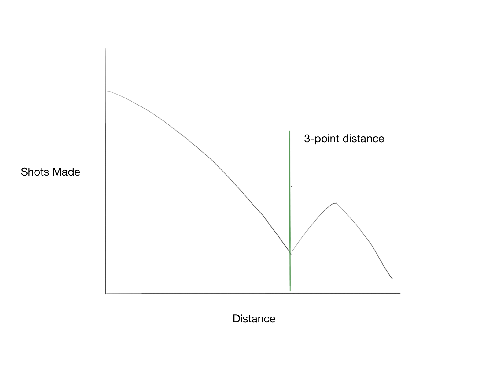
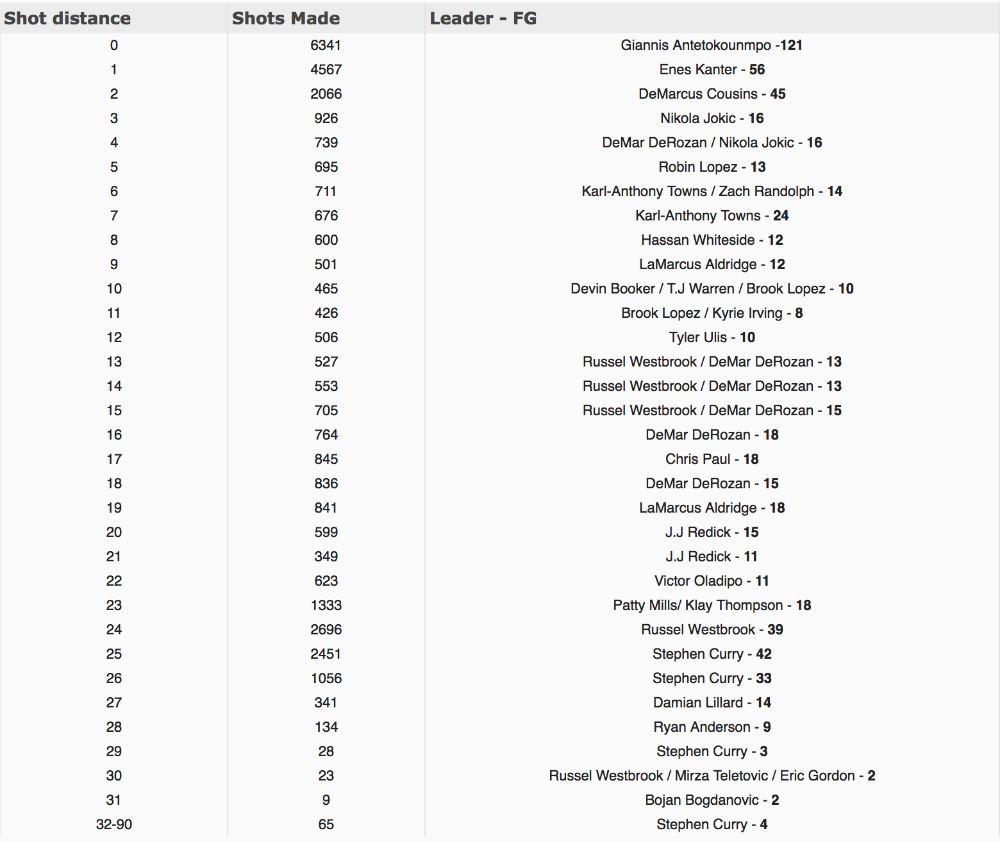

## In one NBA season, what is the breakdown of shots made by distance?

This question came in to my head one day and I was curious to find the answer. I felt that it I could make a pretty good guess:

### The distance with the most shots made would be the one closest to the basket, and the number of shots made would decrease as the distance increases, until the distance is 3-point line distance, at which point the shots made will spike, but continue to decrease after that initial 3-point line spike.

This hypothesis is pretty wordy, so let's clarify it using a rough sketch:

But I wanted to create a real graph using real statistics. So, I went to the go-to place for NBA statistics; Basketball-Reference.com. And lo and behold, there is 'Shot Finder', which allows you to search shots by a multitude of categories, including team, shot type, and distance. https://www.basketball-reference.com/play-index/shot_finder.cgi

In order to have a significant sample size, I wanted to use all of the shots made during the 2016-2017 NBA Season. Unfortunately, this desire to have a large sample size left me staring at extensive data tables with hundreds of rows, and no way to add up the numbers other than pen and paper. 428 players made at least one shot from the 0-foot distance in the 2016-2017 NBA season. And because Basketball-Reference.com displays 100 rows at a time, summing up these numbers would involve adding up 428 numbers between 5 different web pages. And this is only for the one distance. 

There had to be a better solution. I asked my web developer friends if they had any ideas, but it turns out most web-devs don't spend much time parsing data tables on sports data websites. So I went digging in to Chrome's dev tools to inspect the data table elements, and I found the following HTML for rows in the data table:


  <td class=“right” data-stat=“fg”> 121 </td>


This element represents the FG (shots) made by one player. Because all of the FG data rows have a 'data-stat' attribute set to "fg", I could isolate all of the elements with this attribute value using the following command in the developer console:


  let list = document.querySelectorAll("[data-stat='fg']")


Now that I had the list of all of the FG elements, I just needed a way to parse through it and add up all of the values. I am no expert in JavaScript, so I struggled mightily with forEach and for-in loops in my attempt to iterate through this list. Eventually, I found that a classic C-style for loop worked. So after including a check to ensure that the element is a number (!isNan), I ended up with the following loop: 


var sum = 0
for (var i = 0; i < list.length; i++) { 
	if (!isNaN(parseInt(list[i].innerText))) 
	{ 
		sum += parseInt(list[i].innerText) 
	} 
}


This code effectively gave me the sum of all of the FG-made numbers on the page. But because Basketball-Reference.com shows a maximum of 100 rows per page, and there were 428 rows (5 pages) for the 0-ft FG, I needed to run this script on the following 4 pages. Ideally, this script could run through all of the shot distances and return the sums for each distance, but it is limited by Basketball-Reference.com's limited exposure of data sets. Luckily, this script makes parsing the data much faster than adding it up by hand, or even by calculator. 

I ran this script on each distance from 0ft to 31ft and the range of 32-90ft. I also tracked the shot-leader for each distance, and ended up with the following data:

It is important to note the 3-point distance here, because the 3-point distance in the corner is 22ft and the non-corner 3-point line is 23.75ft. With that in mind, the minor spike at 22ft makes sense, as there is more corner 3-pointers made than deep 2-pointers. This is followed by a more severe spike in shots made at 23-25ft, which encapsulates most of the non-corner 3-pointers made. 

## Links

**Shot Finder:** https://www.basketball-reference.com/play-index/shot_finder.cgi

**Basketball Court Dimensions:** https://en.wikipedia.org/wiki/Basketball_court

**Reddit Post**: https://www.reddit.com/r/nba/comments/7mbxv9/20162017_season_fg_by_distance/

